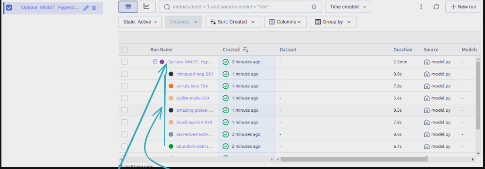
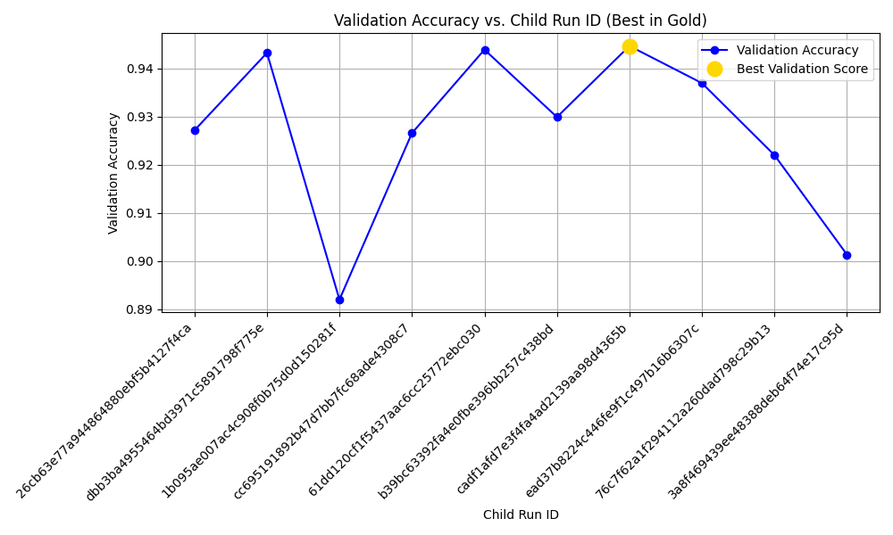

# Hyperparameter Tuning with Optuna: Parent and Child Runs

## Overview
This repository demonstrates how to implement hyperparameter tuning using Optuna's parent and child run concepts. The project uses the MNIST dataset with a simple neural network model (Multi-Layer Perceptron) to showcase how advanced hyperparameter optimization can improve model performance.

## What is HyperParameter tuning
Hyperparameter tuning involves testing different sets of hyperparameters to find the best combination for a machine learning model. This process can be done manually or through automated methods. It requires running multiple experiments with different hyperparameters, evaluating each model's performance using metrics like the loss function. Since it involves repeated model training, hyperparameter tuning is both crucial and computationally intensive.

## What Are Hyperparameters?
Hyperparameters are external settings that data scientists manually configure before training a machine learning model. Unlike internal parameters, which the model learns automatically during training, hyperparameters control aspects like model architecture, learning rate, and complexity. Examples of hyperparameters include the number of layers and nodes in a neural network, the learning rate, batch size, number of epochs, regularization strength, and the number of branches in a decision tree.

## Why is Hyperparameter Tuning Important?
Hyperparameters directly influence a model's structure, function, and overall performance. Tuning these hyperparameters helps data scientists optimize model performance by finding the best settings. Choosing the right hyperparameter values is critical for success in machine learning.

For example, if the learning rate (a common hyperparameter) is too high, the model might converge too quickly, leading to suboptimal results. Conversely, if the learning rate is too low, training may take too long, and the model might not converge effectively. Proper hyperparameter tuning ensures balanced training, leading to accurate models and strong performance.

## What are the Hyperparameter Tuning Techniques?
There are several hyperparameter tuning methods, with the most common being **Bayesian optimization**, **grid search**, and **random search**.

- **Bayesian Optimization:** This technique uses Bayes' theorem to build a probabilistic model of hyperparameters, optimizing a specific performance metric. By applying regression analysis, it iteratively selects the best set of hyperparameters, balancing exploration and exploitation.

- **Grid Search:** In grid search, you define a list of possible hyperparameters and a performance metric. The algorithm exhaustively evaluates all possible combinations to find the best fit. While effective, grid search can be computationally expensive, especially with a large hyperparameter space.

- **Random Search:** Like grid search, random search evaluates hyperparameter combinations but does so randomly. It is particularly useful when only a few hyperparameters significantly impact model performance, offering a quicker and often effective alternative to grid search.

## Optuna : An open-source hyperparameter optimization framework

**Optuna** is an open-source hyperparameter optimization framework designed for efficiency and flexibility. It uses advanced techniques like **Bayesian optimization**, **Tree-structured Parzen Estimator (TPE)**, and **multi-objective optimization** to automatically find the best hyperparameters for machine learning models.

Optuna effectively performs:
- **Automated Hyperparameter Tuning:** It minimizes manual effort by suggesting optimal hyperparameters automatically.
- **Pruning Unpromising Trials:** During model training, Optuna can stop underperforming trials early to save computational resources.
- **Search Space Flexibility:** It supports both **discrete** and **continuous** hyperparameter spaces and offers **dynamic search spaces**, allowing conditional parameters.
- **Visualization Tools:** It provides insightful visualizations to analyze hyperparameter search results.

Overall, Optuna simplifies and accelerates the hyperparameter tuning process, making it an excellent choice for both beginners and advanced users.

## Why Optuna is Better Than GridSearchCV and RandomizedSearchCV
While **Grid Search CV** and **Random Search CV** are popular hyperparameter tuning methods, **Optuna** offers several distinct advantages:

1. **Efficiency and Speed:** Uses **Bayesian optimization** and **Tree-structured Parzen Estimator (TPE)**, which intelligently explore the search space, focusing on promising areas and reducing unnecessary trials.

2. **Dynamic Search Spaces:** Unlike grid and random search, **Optuna** allows **dynamic search spaces**, where hyperparameters can depend on each other. This flexibility is particularly useful for complex models.

3. **Early Stopping (Pruning):** **Optuna** supports **pruning of underperforming trials**, saving time and computational resources by stopping bad runs early. This feature is not available in grid or random search.

4. **Automated and Adaptive:** **Optuna** adapts the search strategy based on the results of previous trials, improving its ability to find optimal hyperparameters efficiently.

5. **Support for Multi-Objective Optimization:** **Optuna** can optimize multiple objectives simultaneously, which is particularly useful in scenarios requiring a balance between conflicting metrics (e.g., accuracy and inference time).

6. **Visualization and Analysis Tools:** **Optuna** provides built-in visualization tools to analyze the tuning process, making it easier to understand and refine hyperparameter search strategies.

## Parent and Child Runs in Optuna
When using Optuna for hyperparameter tuning, you can leverage the concept of parent and child runs to structure your optimization process more effectively.

## How to Implement Hyperparameter Tuning Following Parent and Child Runs in Optuna
This repository demonstrates how to implement hyperparameter tuning following **parent** and **child runs** in Optuna using the **MNIST dataset** and a **simple neural network model (multi-layer perceptron)**.

## How to Run This Project
### Prerequisites
- Python 3.8+
- Git

### Installation Steps
```bash
# Clone the repository
git clone <repository-link>
cd <repository-directory>

# Create and activate a virtual environment
python3 -m venv env
source env/bin/activate

# Install dependencies
pip install -r requirements.txt

# Run the hyperparameter tuning
python main.py

# Launch the MLflow UI
mlflow ui
```

After running `mlflow ui`, open `http://localhost:5000` in your browser to visualize the hyperparameter tuning results.

## Results Visualization
### Parent and Child Runs Visualization


### Validation Accuracy vs. Runs


## Conclusion
Using Optuna with parent and child runs enhances hyperparameter tuning efficiency and model performance. The dynamic search space, early stopping, and advanced visualization tools make it an excellent choice for machine learning practitioners.

## License
This project is licensed under the MIT License. See the LICENSE file for details.

## Acknowledgments
- **Optuna Documentation:** https://optuna.org
- **MLflow:** For experiment tracking and visualization
- **MNIST Dataset:** From TensorFlow/Keras datasets

